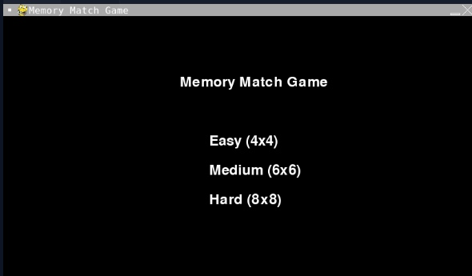
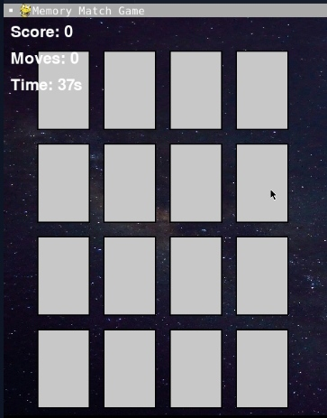

# Memory Match Game

A fun and engaging memory match game developed using Python and Pygame.

## Game Description

The Memory Match Game is a simple card-matching game where the player must match pairs of cards by flipping them over and remembering their positions. The game ends when all pairs have been matched.

## Features

- Multiple card colors
- Flip card animation
- Score tracking
- Move counter
- Timer
- Sound effects for flipping and matching cards
- Game Over screen with final score


## Screenshots




## Modules and Libraries

The game uses the following Python modules and libraries:

- `pygame`: A set of Python modules designed for writing video games. Pygame adds functionality on top of the excellent SDL library.


## Installation

1. **Clone the repository:**

    ```bash
    git clone https://github.com/JohnDev19/memory-match-game.git
    cd memory-match-game
    ```

2. **Create a virtual environment (optional but recommended):**

    ```bash
    python -m venv venv
    source venv/bin/activate   # On Windows use `venv\Scripts\activate`
    ```

3. **Install the required dependencies:**

    ```bash
    pip install pygame
    ```

4. **Download assets:**

    Ensure you have the following files in your project structure:
    - `images/background.jpg`
    - `sounds/flip.mp3`
    - `sounds/match.mp3`
    - `sounds/failed.mp3`

## Usage

Run the game using the following command:

```bash
python main.py
```

## License

This project is licensed under the MIT License - see the [LICENSE](LICENSE) file for details.
